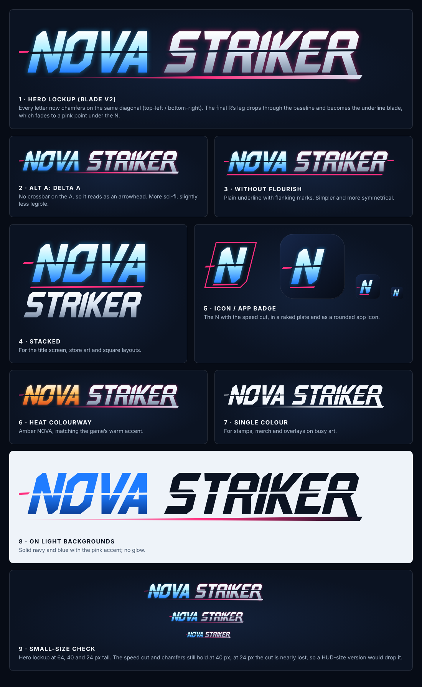

# Nova Striker logo: Blade (exploration)

A proposed sci-fi / aggressive wordmark for the fresh-start prototype. Like the rest of this folder it is
exploration, not approved final branding. Every letter is a custom-drawn vector shape; no stock fonts are used.



## Design rules

- 100-unit cap height, letters slanted 14°.
- Every letter cuts off its top-left and bottom-right corners, on the same diagonal as the slant.
- A thin speed-cut runs through every letter just above the middle, with a pink tick leading in on the left.
- Hero version: the final R's leg sweeps below the baseline into the underline, which tapers to a pink point
  under the N.
- Colours come from the game's palette: navy `#0b1322`, cyan / blue NOVA, steel STRIKER, hostile pink
  `#ff2e7e` accents, amber `#ffb547` for the heat version.

## Variants

| File | Use |
| --- | --- |
| `nova-striker-hero` | Main logo: R flourish, standard A, cyan NOVA |
| `nova-striker-hero-delta` | A without a crossbar (Λ) |
| `nova-striker-hero-plain` | Plain underline with side marks, no R flourish |
| `nova-striker-hero-heat` | Amber NOVA |
| `nova-striker-hero-mono` | Single colour, for merch and busy art |
| `nova-striker-hero-light` | For light backgrounds |
| `nova-striker-stacked` | NOVA over STRIKER, for title screens and square layouts |
| `nova-striker-icon-plate` | N in a slanted frame |
| `nova-striker-icon-app` | Rounded app icon (PNG at 1024, 512, 192, 64 and 32 px) |

`svg/` holds the scalable masters; `png/` holds transparent exports. Below about 24 px tall the speed-cut
disappears, so an in-game HUD version should leave it out.

## Rebuilding

The letterforms and layouts are in `source/blade.mjs`. To regenerate every SVG and PNG after a change:

```
node source/build.mjs
```

PNG export needs Playwright (local or global install).
